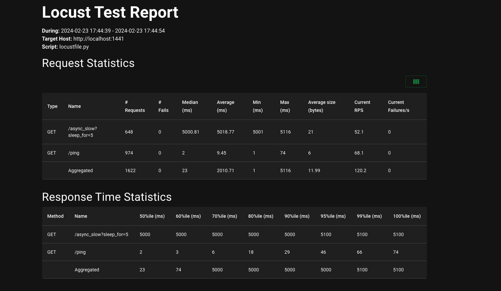

# Monitored IO Loop
A production ready monitored IO loop for Python.  
No more wondering why your event loop (or random pieces of your code) are suddenly popping up as slow in your monitoring.

## Getting started
### Installation
```bash
pip install monitored_io_loop  # For the default event loop
pip install monitored_io_loop[uvloop]  # For the the additional support of the uvloop event loop
```

### Usage asyncio
```python
from monitored_ioloop.monitored_asyncio import MonitoredAsyncIOEventLoopPolicy, IoLoopMonitorState
import asyncio
import time


def monitor_callback(ioloop_state: IoLoopMonitorState) -> None:
    print(ioloop_state)


async def test_coroutine() -> None:
    time.sleep(2)


def main():
    asyncio.set_event_loop_policy(MonitoredAsyncIOEventLoopPolicy(monitor_callback))
    asyncio.run(test_coroutine())
```

### Usage uvloop
In order to use the uvloop event loop, please make sure to install `monitored_io_loop[uvloop]`.
```python
from monitored_ioloop.monitored_uvloop import MonitoredUvloopEventLoopPolicy, IoLoopMonitorState
import asyncio
import time


def monitor_callback(ioloop_state: IoLoopMonitorState) -> None:
    print(ioloop_state)


async def test_coroutine() -> None:
    time.sleep(2)


def main():
    asyncio.set_event_loop_policy(MonitoredUvloopEventLoopPolicy(monitor_callback))
    asyncio.run(test_coroutine())

```

## The monitor callback
The monitor callback will be called for every execution that the event loop initiates.  
With every call you will receive an [IoLoopMonitorState](monitored_ioloop/types.py) object that contains the following information:
- `wall_loop_duration`: The time it took to execute the current step of the event loop in wall time.
- `cpu_loop_duration`: The time it took to execute the current step of the event loop in CPU time.


## Performance impact
As many of you might be concerned about the performance impact of this library, I have run some benchmarks to measure the performance impact of this library.  
After running the [following benchmarks](stress_tests) I can confidently say that the performance impact is negligible.  
__Hardware__: Apple M1 Pro 2022 32GB RAM  
__Vanilla asyncio__

__Monitored asyncio__


__Vanilla uvloop__

__Monitored uvloop__


## Roadmap
- [ ] Add support for the amount of `Handle`'s on the event loop
- [ ] Add visibility into which `Handle` are making the event loop slower
- [ ] Add easier integration with popular monitoring tools like Prometheus
- [ ] Add easier integration with `uvicorn`
- [ ] Add an examples folder

## Credits
I took a lot of inspiration from the [uvloop](https://github.com/MagicStack/uvloop) project with everythin
regarding the user interface of swapping the IO loop.